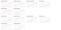
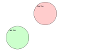
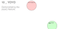
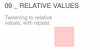
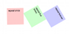
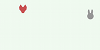
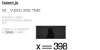
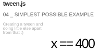
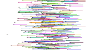

# tween.js

JavaScript tweening engine for easy animations, incorporating optimised Robert Penner's equations.

[![NPM Version][npm-image]][npm-url]
[![NPM Downloads][downloads-image]][downloads-url]
[![Travis tests][travis-image]][travis-url]
[![Flattr this][flattr-image]][flattr-url]
[![CDNJS][cdnjs-image]][cdnjs-url]

```javascript
const box = document.createElement('div');
box.style.setProperty('background-color', '#008800');
box.style.setProperty('width', '100px');
box.style.setProperty('height', '100px');
document.body.appendChild(box);

// Setup the animation loop.
function animate(time) {
    requestAnimationFrame(animate);
    TWEEN.update(time);
}
requestAnimationFrame(animate);

const coords = { x: 0, y: 0 }; // Start at (0, 0)
const tween = new TWEEN.Tween(coords) // Create a new tween that modifies 'coords'.
        .to({ x: 300, y: 200 }, 1000) // Move to (300, 200) in 1 second.
        .easing(TWEEN.Easing.Quadratic.Out) // Use an easing function to make the animation smooth.
        .onUpdate(() => { // Called after tween.js updates 'coords'.
            // Move 'box' to the position described by 'coords' with a CSS translation.
            box.style.setProperty('transform', `translate(${coords.x}px, ${coords.y}px)`);
        })
        .start(); // Start the tween immediately.
```

[Test it with CodePen](https://codepen.io/mikebolt/pen/zzzvZg)

## Installation

Download the [library](https://raw.githubusercontent.com/tweenjs/tween.js/master/src/Tween.js) and include it in your code:

```html
<script src="js/Tween.js"></script>
```

You can also reference a CDN-hosted version in your code, thanks to cdnjs. For example:

```html
<script src="https://cdnjs.cloudflare.com/ajax/libs/tween.js/16.3.5/Tween.min.js"></script>
```

See [tween.js](https://cdnjs.com/libraries/tween.js/) for more versions.

### More advanced users might want to...

#### Use `npm`

```bash
npm install @tweenjs/tween.js
```

Then include the Tween.js module with the standard node.js `require`:

```javascript
const TWEEN = require('@tweenjs/tween.js');
```

And you can use Tween.js as in all other examples--for example:

```javascript
const t = new TWEEN.Tween( /* etc */ );
t.start();
```

You will need to use a tool such as `browserify` to convert code using this style into something that can be run in the browser (browsers don't know about `require`).

#### Use `bower`

```bash
bower install tweenjs/tween.js --save
```

Then reference the library source:

```html
<script src="bower_components/tweenjs/src/Tween.js"></script>
```

## Features

* Does one thing and one thing only: tween properties
* Doesn't take care of CSS units (e.g. appending `px`)
* Doesn't interpolate colours
* Easing functions are reusable outside of Tween
* Can also use custom easing functions

## Documentation

* [User guide](./docs/user_guide.md)
* [Contributor guide](./docs/contributor_guide.md)
* [Tutorial](http://learningthreejs.com/blog/2011/08/17/tweenjs-for-smooth-animation/)  using tween.js with three.js
* Also: [libtween](https://github.com/jsm174/libtween), a port of tween.js to C by [jsm174](https://github.com/jsm174)
* Also: [es6-tween](https://github.com/tweenjs/es6-tween), a port of tween.js to ES6/Harmony by [dalisoft](https://github.com/dalisoft)
* [Understanding tween.js](https://mikebolt.me/article/understanding-tweenjs.html)

## Examples

<table>
	<tr>
		<td>
			<a href="http://tweenjs.github.io/tween.js/examples/12_graphs_custom_functions.html">
				
			</a>
		</td>
		<td>
			Custom functions<br />
			(<a href="examples/12_graphs_custom_functions.html">source</a>)
		</td>
		<td>
			<a href="http://tweenjs.github.io/tween.js/examples/11_stop_all_chained_tweens.html">
				
			</a>
		</td>
		<td>
			Stop all chained tweens<br />
			(<a href="examples/11_stop_all_chained_tweens.html">source</a>)
		</td>
	</tr>
	<tr>
		<td>
			<a href="http://tweenjs.github.io/tween.js/examples/10_yoyo.html">
				
			</a>
		</td>
		<td>
			Yoyo<br />
			(<a href="examples/10_yoyo.html">source</a>)
		</td>
		<td>
			<a href="http://tweenjs.github.io/tween.js/examples/09_relative_values.html">
				
			</a>
		</td>
		<td>
			Relative values<br />
			(<a href="examples/09_relative_values.html">source</a>)
		</td>
	</tr>
	<tr>
		<td>
			<a href="http://tweenjs.github.io/tween.js/examples/08_repeat.html">
				
			</a>
		</td>
		<td>
			Repeat<br />
			(<a href="examples/08_repeat.html">source</a>)
		</td>
		<td>
			<a href="http://tweenjs.github.io/tween.js/examples/07_dynamic_to.html">
				
			</a>
		</td>
		<td>
			Dynamic to<br />
			(<a href="examples/07_dynamic_to.html">source</a>)
		</td>
	</tr>
	<tr>
		<td>
			<a href="http://tweenjs.github.io/tween.js/examples/06_array_interpolation.html">
				
			</a>
		</td>
		<td>
			Array interpolation<br />
			(<a href="examples/06_array_interpolation.html">source</a>)
		</td>
		<td>
			<a href="http://tweenjs.github.io/tween.js/examples/05_video_and_time.html">
				
			</a>
		</td>
		<td>
			Video and time<br />
			(<a href="examples/05_video_and_time.html">source</a>)
		</td>
	</tr>
	<tr>
		<td>
			<a href="http://tweenjs.github.io/tween.js/examples/04_simplest.html">
				
			</a>
		</td>
		<td>
			Simplest possible example<br />
			(<a href="examples/04_simplest.html">source</a>)
		</td>
		<td>
			<a href="http://tweenjs.github.io/tween.js/examples/03_graphs.html">
				
			</a>
		</td>
		<td>
			Graphs<br />
			(<a href="examples/03_graphs.html">source</a>)
		</td>
	</tr>
	<tr>
		<td>
			<a href="http://tweenjs.github.io/tween.js/examples/02_black_and_red.html">
				
			</a>
		</td>
		<td>
			Black and red<br />
			(<a href="examples/02_black_and_red.html">source</a>)
		</td>
		<td>
			<a href="http://tweenjs.github.io/tween.js/examples/01_bars.html">
				
			</a>
		</td>
		<td>
			Bars<br />
			(<a href="examples/01_bars.html">source</a>)
		</td>
	</tr>
	<tr>
		<td>
			<a href="http://tweenjs.github.io/tween.js/examples/00_hello_world.html">
				
			</a>
		</td>
		<td>
			hello world<br />
			(<a href="examples/00_hello_world.html">source</a>)
		</td>
	</tr>
</table>

## Tests

You need to install `npm` first--this comes with node.js, so install that one first. Then, cd to `tween.js`'s directory and run:

```bash
npm install
```

if running the tests for the first time, to install additional dependencies for running tests, and then run

```bash
npm test
```

every time you want to run the tests.

If you want to add any feature or change existing features, you *must* run the tests to make sure you didn't break anything else. If you send a pull request (PR) to add something new and it doesn't have tests, or the tests don't pass, the PR won't be accepted. See [contributing](CONTRIBUTING.md) for more information.

## People

Maintainers: [mikebolt](https://github.com/mikebolt), [sole](https://github.com/sole).

[All contributors](http://github.com/tweenjs/tween.js/contributors).

## Projects using tween.js

[](https://aframe.io)
[](http://www.moma.org/interactives/exhibitions/2012/inventingabstraction/)
[](http://www.chromeweblab.com/)
[](http://5013.es/toys/macchina)
[](http://egraether.com/mine3d/)
[](http://ro.me)
[](http://data-arts.appspot.com/globe)
[](http://www.androidify.com/)
[](http://thewildernessdowntown.com/)
[](http://dejavis.org/linechart)

[npm-image]: https://img.shields.io/npm/v/@tweenjs/tween.js.svg
[npm-url]: https://npmjs.org/package/@tweenjs/tween.js
[downloads-image]: https://img.shields.io/npm/dm/@tweenjs/tween.js.svg
[downloads-url]: https://npmjs.org/package/@tweenjs/tween.js
[travis-image]: https://travis-ci.org/tweenjs/tween.js.svg?branch=master
[travis-url]: https://travis-ci.org/tweenjs/tween.js
[flattr-image]: https://api.flattr.com/button/flattr-badge-large.png
[flattr-url]: https://flattr.com/thing/45014/tween-js
[cdnjs-image]: https://img.shields.io/cdnjs/v/tween.js.svg
[cdnjs-url]: https://cdnjs.com/libraries/tween.js

