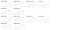
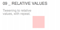
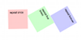
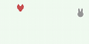
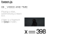
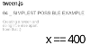
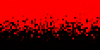
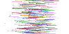

# tween.js

tween.js 是用于简单动画的 JavaScript 补间引擎，结合了优化的 Robert Penner 方程。

[![NPM Version][npm-image]][npm-url]
[![NPM Downloads][downloads-image]][downloads-url]
[![Travis tests][travis-image]][travis-url]
[![Flattr this][flattr-image]][flattr-url]
[![CDNJS][cdnjs-image]][cdnjs-url]

```javascript
var box = document.createElement('div')
box.style.setProperty('background-color', '#008800')
box.style.setProperty('width', '100px')
box.style.setProperty('height', '100px')
document.body.appendChild(box)

// 设置循环动画
function animate(time) {
	requestAnimationFrame(animate)
	TWEEN.update(time)
}
requestAnimationFrame(animate)

var coords = {x: 0, y: 0} // 起始点 (0, 0)
var tween = new TWEEN.Tween(coords) // 创建一个新的tween用来改变 'coords'
	.to({x: 300, y: 200}, 1000) // 在1s内移动至 (300, 200)
	.easing(TWEEN.Easing.Quadratic.Out) // 使用缓动功能使的动画更加平滑
	.onUpdate(function () {
		// 在 tween.js 更新 'coords' 后调用
		// 将 'box' 移动到 'coords' 所描述的位置，配合 CSS 过渡
		box.style.setProperty('transform', 'translate(' + coords.x + 'px, ' + coords.y + 'px)')
	})
	.start() // 立即开始 tween
```

[在线代码测试](https://codepen.io/mikebolt/pen/zzzvZg)

## 安装

下载 [library](https://raw.githubusercontent.com/tweenjs/tween.js/master/src/Tween.js) 并将它引入至你的代码中:

```html
<script src="js/Tween.js"></script>
```

您也可以在代码中引用 CDN 托管的版本，这要感谢 cdnjs 。例如:

```html
<script src="https://cdnjs.cloudflare.com/ajax/libs/tween.js/16.3.5/Tween.min.js"></script>
```

See [tween.js](https://cdnjs.com/libraries/tween.js/) for more versions.

查看更多 [tween.js](https://cdnjs.com/libraries/tween.js/) 版本.

### 更多高级用户想要的...

#### 使用 `npm`

```bash
npm install @tweenjs/tween.js
```

然后用标准的 node.js `require` 包含 Tween.js 模块:

```javascript
var TWEEN = require('@tweenjs/tween.js')
```

您可以像所有其他示例一样使用 Tween.js，例如:

```javascript
var t = new TWEEN.Tween(/* etc */)
t.start()
```

你将需要使用诸如`browserify`之类的工具将使用此风格的代码转换为可以在浏览器中运行的代码(浏览器无法识别 `require`)

#### Use `bower`

```bash
bower install @tweenjs/tweenjs --save
```

或者安装特定的 tag.他们是 git tags,如果你已经在本地克隆仓库，你可以在命令行中运行`git tag`查看 tag 列表,或者你可以查看下 [tween.js tags page](https://github.com/tweenjs/tween.js/tags) 列表.例如,安装 `v16.3.0`:

```bash
bower install @tweenjs/tweenjs#v16.3.0
```

然后引入库源码:

```html
<script src="bower_components/@tweenjs/tweenjs/src/Tween.js"></script>
```

## Features

- 只做一件事且仅只做一件事: 补间特性
- 不关注 CSS 单位 (e.g. appending `px`)
- 不插入颜色
- 缓和功能可以在 Tween 之外重用
- 也可以使用自定义缓动功能

## Documentation

- [使用指南](./docs/user_guide_zh-CN.md)
- [贡献者指南](./docs/contributor_guide_zh-CN.md)
- [教程](http://learningthreejs.com/blog/2011/08/17/tweenjs-for-smooth-animation/) using tween.js with three.js
- 其他: [libtween](https://github.com/jsm174/libtween), [jsm174](https://github.com/jsm174) 写的一个 C 语言版本的 tween.js.
- 其他: [es6-tween](https://github.com/tweenjs/es6-tween), [dalisoft](https://github.com/dalisoft) 写的一个 ES6/Harmony 版本的 tween.js.
- [理解 tween.js](https://mikebolt.me/article/understanding-tweenjs.html)

## 示例

<table>
	<tr>
		<td>
			<a href="http://tweenjs.github.io/tween.js/examples/12_graphs_custom_functions.html">
				
			</a>
		</td>
		<td>
			Custom functions<br />
			(<a href="examples/12_graphs_custom_functions.html">source</a>)
		</td>
		<td>
			<a href="http://tweenjs.github.io/tween.js/examples/11_stop_all_chained_tweens.html">
				
			</a>
		</td>
		<td>
			Stop all chained tweens<br />
			(<a href="examples/11_stop_all_chained_tweens.html">source</a>)
		</td>
	</tr>
	<tr>
		<td>
			<a href="http://tweenjs.github.io/tween.js/examples/10_yoyo.html">
				
			</a>
		</td>
		<td>
			Yoyo<br />
			(<a href="examples/10_yoyo.html">source</a>)
		</td>
		<td>
			<a href="http://tweenjs.github.io/tween.js/examples/09_relative_values.html">
				
			</a>
		</td>
		<td>
			Relative values<br />
			(<a href="examples/09_relative_values.html">source</a>)
		</td>
	</tr>
	<tr>
		<td>
			<a href="http://tweenjs.github.io/tween.js/examples/08_repeat.html">
				
			</a>
		</td>
		<td>
			Repeat<br />
			(<a href="examples/08_repeat.html">source</a>)
		</td>
		<td>
			<a href="http://tweenjs.github.io/tween.js/examples/07_dynamic_to.html">
				
			</a>
		</td>
		<td>
			Dynamic to<br />
			(<a href="examples/07_dynamic_to.html">source</a>)
		</td>
	</tr>
	<tr>
		<td>
			<a href="http://tweenjs.github.io/tween.js/examples/06_array_interpolation.html">
				
			</a>
		</td>
		<td>
			Array interpolation<br />
			(<a href="examples/06_array_interpolation.html">source</a>)
		</td>
		<td>
			<a href="http://tweenjs.github.io/tween.js/examples/05_video_and_time.html">
				
			</a>
		</td>
		<td>
			Video and time<br />
			(<a href="examples/05_video_and_time.html">source</a>)
		</td>
	</tr>
	<tr>
		<td>
			<a href="http://tweenjs.github.io/tween.js/examples/04_simplest.html">
				
			</a>
		</td>
		<td>
			Simplest possible example<br />
			(<a href="examples/04_simplest.html">source</a>)
		</td>
		<td>
			<a href="http://tweenjs.github.io/tween.js/examples/03_graphs.html">
				
			</a>
		</td>
		<td>
			Graphs<br />
			(<a href="examples/03_graphs.html">source</a>)
		</td>
	</tr>
	<tr>
		<td>
			<a href="http://tweenjs.github.io/tween.js/examples/02_black_and_red.html">
				
			</a>
		</td>
		<td>
			Black and red<br />
			(<a href="examples/02_black_and_red.html">source</a>)
		</td>
		<td>
			<a href="http://tweenjs.github.io/tween.js/examples/01_bars.html">
				
			</a>
		</td>
		<td>
			Bars<br />
			(<a href="examples/01_bars.html">source</a>)
		</td>
	</tr>
	<tr>
		<td>
			<a href="http://tweenjs.github.io/tween.js/examples/00_hello_world.html">
				
			</a>
		</td>
		<td>
			hello world<br />
			(<a href="examples/00_hello_world.html">source</a>)
		</td>
	</tr>
</table>

## Tests

你首先需要安装`npm`--基于 node.js,所以首先安装它.然后,进入到`tween.js`的目录下并运行:

```bash
npm install
```

如果是第一次运行测试,则为运行测试安装额外的依赖,然后运行

```bash
npm test
```

每次你想运行测试.

如果你想添加任何功能或改变现有的功能，你*必须*运行测试，以确保你没有影响别的东西.如果你发一个 pull request（PR）添加新的东西,它没有测试,或测试不通过,这个 PR 将不被接受.更详细的请看 [contributing](CONTRIBUTING.md).

## People

维护者: [mikebolt](https://github.com/mikebolt), [sole](https://github.com/sole).

[所有贡献者](http://github.com/tweenjs/tween.js/contributors).

## 使用 tween.js 的项目

[](https://aframe.io)
[](http://www.moma.org/interactives/exhibitions/2012/inventingabstraction/)
[](http://www.chromeweblab.com/)
[](http://5013.es/toys/macchina)
[](http://egraether.com/mine3d/)
[](http://ro.me)
[](http://data-arts.appspot.com/globe)
[](http://www.androidify.com/)
[](http://thewildernessdowntown.com/)
[](http://dejavis.org/linechart)

[npm-image]: https://img.shields.io/npm/v/@tweenjs/tween.js.svg
[npm-url]: https://npmjs.org/package/@tweenjs/tween.js
[downloads-image]: https://img.shields.io/npm/dm/@tweenjs/tween.js.svg
[downloads-url]: https://npmjs.org/package/@tweenjs/tween.js
[travis-image]: https://travis-ci.org/tweenjs/tween.js.svg?branch=master
[travis-url]: https://travis-ci.org/tweenjs/tween.js
[flattr-image]: https://api.flattr.com/button/flattr-badge-large.png
[flattr-url]: https://flattr.com/thing/45014/tween-js
[cdnjs-image]: https://img.shields.io/cdnjs/v/tween.js.svg
[cdnjs-url]: https://cdnjs.com/libraries/tween.js
