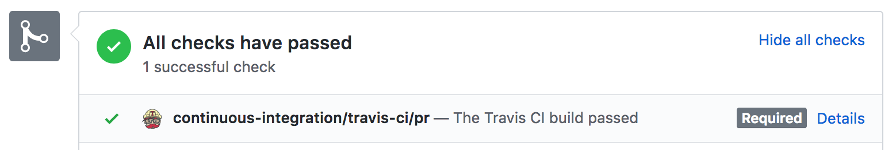
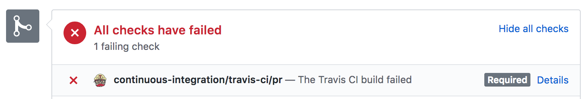

# tween.js contributor guide

This guide is for people who want to *contribute* to the library or are curious to learn what's behind the scenes: how is it tested? what do we automate? how do we do releases? etc.

If you are looking for documentation on *how to use* the library, the [user guide](./user_guide.md) is for you.

**NOTE: this document is a work in progress. More content will be added in stages. If you have questions you'd like to see answered, please add them [as comments on this issue](https://github.com/tweenjs/tween.js/issues/323). THANKS!**

In this guide:

* [Developer requirements](#developer-requirements)
* [Testing](#testing)
* [Continuous integration](#continuous-integration)
* [Release process](#release-process)

## Developer requirements

Although tween.js does *not* need node.js to work, we use it for development. So you will need to [install node.js](https://nodejs.org/en/download/) before you can work on the library.

Node.js includes the `npm` tool that we use to run scripts such as the one for packaging, running tests, etc. Please make sure it is working in your system before you attempt to run any of the steps detailed below.

Once node.js is installed, clone the tween.js repository:

```bash
git clone https://github.com/tweenjs/tween.js.git
```

Change to the folder:

```bash
cd tween.js
```

And run the script to install development dependencies:

```bash
npm install
```

Or in three lines:

```bash
git clone https://github.com/tweenjs/tween.js.git
cd tween.js
npm install
```

Once `npm install` completes successfully, try having a go at running the tests:

```bash
npm test
```

If you get issues running any of the above, try to search for the text of the error using your search engine of choice. This is normally the fastest route, as many people might have encountered the same issue already.

## Testing

There's a suite of automated tests in the `test` directory.

These can quickly spot regressions on the code--useful when new features are added or when code is changed to fix a bug; we don't want to introduce new bugs! They also spot style issues, which helps us keep the library cohesive.

To run the tests, type:

```bash
npm test
```

You should run the tests after you change code in the library. If you change the behaviour the tests describe, the tests won't pass and you'll get an error pointing to the test(s) that failed. This might be either because...

* you overlooked something or there's an error in your code, or...
* the library or the tests themselves are wrong

The one that happens more frequently is the first one, but the second one has happened, with edge cases.

**Another thing you should do once the automated tests pass is to run the examples in the `examples` folder**. It is rare, but it might happen that your changes introduced cosmetic differences that the automated tests are not checking for, and the only way to notice this is by running the examples and have a human spot the difference in output. If you don't want to checkout two copies of the library, you can look at [the online examples](https://github.com/tweenjs/tween.js#examples).

### Unit tests

Tests are in the `test/unit/tests.js` file.

The tests are executed using [nodeunit](https://www.npmjs.com/package/nodeunit).

**TODO:** the tests should also work if opening `test/unit/nodeunit.html` in a browser, but they are broken right now. There is [an open issue](https://github.com/tweenjs/tween.js/issues/307) to make them work again.

### Correction and style tests

We use [JSCS](http://jscs.info/) and [JSHint](http://jshint.com/) to ensure the code style is uniform.

#### JSCS

This tool helps us spot mostly 'cosmetic' code style issues. For example, white spaces versus tabs, spaces between brackets, etc.

To run it:

```bash
npm run test-style
```

The rules for JSCS are in `test/jscs.json`.

#### JSHint

This tool helps us spot code quality issues. For example, using the right equality operator, unused variables, etc.

To run it:

```bash
npm run test-correctness
```

The rules for JSHint are in `test/jshintrc`.

### Other types of tests

We would like to test for performance regressions i.e. if a change made things go slower, or simply, for performance, so we can compare the performance of the same code between different browsers.

There's an [open issue](https://github.com/tweenjs/discuss/issues/3) to track work on this, but we have not made progress on it yet. Help! :-)

## Continuous integration

We have implemented a continuous integration system that does things automatically for us. It runs the tests automatically each time a pull request is made, and it can also publish new releases automatically in certain cases.

If proposed changes in a pull request break anything, contributors get feedback without having to wait for a human to have a look at the code. Also, the request cannot be merged until the tests pass.

We are using the Travis CI platform to run the tests. You will find a little information area at the bottom of the pull request page, letting you know about the state of the tests.

Example of all checks passing:



And when checks fail:



If a pull request is updated by adding new commits, the tests will run again.

Travis is configured with the `.travis.yml` file (if you don't see it with your file explorer or the Finder, it's because the file name starts with a dot and so it's *hidden*--try opening it with the terminal).

## Release process

We use the [semantic-release](https://github.com/semantic-release/semantic-release) tool in combination with Travis to automatically [create releases on GitHub](https://github.com/tweenjs/tween.js/releases) and publish them [to npm](https://npmjs.org).

Each time a pull request is merged, Travis will run the tests. If they pass without errors, Travis will run the `after_success` step:

```yaml
after_success:
  - npm run semantic-release
```

This in turn will run the `semantic-release` script in `package.json`:

```json
"semantic-release": "semantic-release pre && npm publish && semantic-release post"
```

And when the new release is made:

* `semantic-release` determines the next version number
* a new entry is added to the GitHub releases list, along with a list of all the commits included in the change, and a ZIP file with that version, for people who want to download ZIPs
* the git commit is tagged with the version number (tools like [Bower](http://bower.io/) use tags)
* it is also published to npm, with the new version number in `package.json`.

**Note:** the default configuration option for `semantic-release` is to run only if the branch name is `master`. Otherwise, we would be generating lots of pushes and releases, as Travis runs with each pull request!

Please also note that the version number in `package.json` is intentionally `0.0.0-development`, as we do not want to encourage anyone to modify this manually, but we also cannot remove the `version` field from the file or installing modules using the git repository directly will fail.

### How the new version number is determined

Like npm, `semantic-release` follows the [semver](http://semver.org/) convention, so each release is identified by a unique `MAJOR.MINOR.PATCH` version number. For example, given version `1.2.3`: 1 = major, 2 = minor, 3 = patch.

In this system, breaking changes (e.g. the API is modified, and updating to a new version might require updating the code that uses the library) should increase the major number. If there are backwards compatible changes (e.g. a new feature that does not modify existing APIs) the minor number will increase. Smaller changes, such as a documentation update, only increase the patch number.

`semantic-release` uses the commit messages to decide on the next version number automatically.

This is really *great*, because keeping track of version numbers or deciding on whether a new release should be a major or minor change is an extremely boring task, best left to machines.

For this to work automatically, the commit messages need to follow a certain syntax:

`<type_of_commit>: <commit log message as usual>.`

The following table lists the types of commits and their effect on version numbers, using [the default behaviour](https://github.com/semantic-release/commit-analyzer/blob/master/src/index.js).

| Type of commit | Description                             | Version increase? |
|----------------|-----------------------------------------|-------------------|
| fix            | fixes a bug but does not change the API | Increases PATCH   |
| style          | formatting changes                      |                   |
| docs           | adding/removing/changing docs           |                   |
| refactor       | rewriting code but not breaking changes, adding features or fixing bugs | |
| test           | changes in tests, e.g. adding a missing one) |              |
| feat           | adding new features which do not change the API | Increases MINOR |
| BREAKING CHANGE | changes the API                        | Increases MAJOR   |

### How to install and configure `semantic-release`

This is mostly for informational purposes, as `semantic-release` is already configured with Travis and contributors shouldn't need to worry about this, but it is good to document everything.

#### Option 1: using the CLI utility

First install the global cli utility:
```bash
npm install -g semantic-release-cli
```

Then in an existing node.js based project (i.e. a `package.json` already exists):

```bash
semantic-release-cli setup
```

It will ask you a series of questions to set up `semantic-release` on the project. If all goes well, the next time you push to GitHub, a new release will automatically happen.

You will need to have TravisCI enabled in your account.

#### Option 2: manually

Install the module:

```bash
npm install --save-dev semantic-release
```

Edit `package.json` to add the `semantic-release` script:

```javascript
"scripts": {
	//...
	"semantic-release": "semantic-release pre && npm publish && semantic-release post"
	//...
},
```

Create a `.travis.yml` file if it doesn't exist yet (here is [help creating `travis.yml` files](https://docs.travis-ci.com/user/getting-started/)), or [have a look at ours](https://github.com/tweenjs/tween.js/blob/master/.travis.yml).

Add an `after_success` section to `.travis.yml`, in order to run `semantic-release`:
```yaml
after_success:
  - npm run semantic-release
```

Now we need to enable the project in Travis CI, so make sure you have an account there and are logged in.

Enable the project in Travis (if you're the maintainer) or ask the maintainer to enable it, in the [Travis settings page](https://travis-ci.org/profile/).

Click on the cog near to the project name to configure some options.

Scroll down until you see *Environment Variables*.

Add tokens for `GH_TOKEN` and `NPM_TOKEN`. Make sure both variables are hidden: `Display value in build log` should be `Off`.

Hopefully, now each time you commit and push to GitHub `semantic-release` will run (if using the `master` branch as described above) and maybe a new version will be published.
